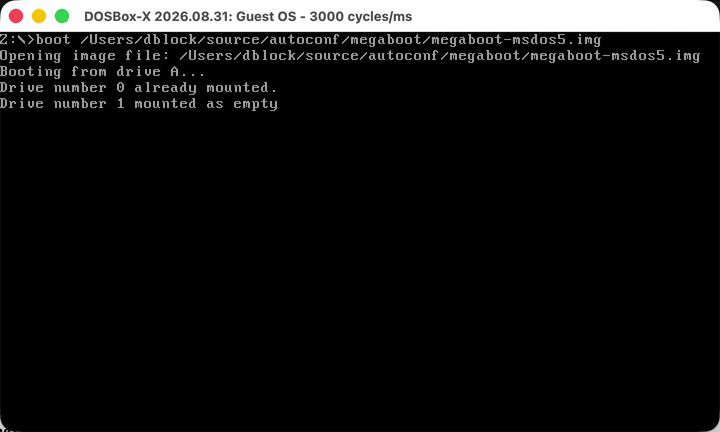

# MegaBoot

MegaBoot 0.9 is a DOS multiple-configuration boot driver written by David Jilli (Titanik) of DSF Productions in 1996. It displays a full-screen menu while DOS processes `CONFIG.SYS`, then rewrites the in-memory configuration so DOS continues with only the selected block.



MegaBoot is a spiritual successor to [Autoconf](https://github.com/dblock/autoconf), an earlier DOS boot-configuration driver.

## Build

The recovered source has been normalized for [JWasm](https://github.com/Baron-von-Riedesel/JWasm): invalid `0xA0` spacing bytes were replaced with spaces, TASM's multi-register `push` and `pop` statements were expanded, and two identifiers were adjusted for MASM-compatible syntax.

Build JWasm, then run from this directory:

```sh
/path/to/jwasm -nologo -bin -Fo=MEGABOOT.SYS m16.asm
```

This creates `MEGABOOT.SYS`. A successful build is approximately 28 KB, starts with the DOS character-device header, and identifies itself as `MEGABOOT`.

## Boot Demo

Copy these files to a bootable MS-DOS disk:

- `MEGABOOT.SYS`
- `CONFIG.SYS`
- `AUTOEXEC.BAT`

Boot a local image with DOSBox-X:

```sh
dosbox-x -fastlaunch -c "boot megaboot-msdos5.img"
```

The sample menu contains:

- `A` - Minimal DOS
- `B` - DOOM
- `C` - Windows 95

MegaBoot recognizes configuration markers written as `INSTALL=%<letter>` and requires a final `INSTALL=%ENDCONFIG` marker. These lines are private control records that MegaBoot rewrites in memory before DOS continues processing `CONFIG.SYS`.

The recovered source originally reserved its 4,000-byte menu background with `binary db 4000 dup (0)`. Those zero-valued text attributes made subsequent DOS output appear black on black after a selection. The restored source uses 2,000 space-and-attribute words (`0720h`) instead, leaving the screen blank with normal gray-on-black text attributes.

The original post-selection marker `VCONFIG=<letter>` is not a valid MS-DOS 5 CONFIG.SYS directive. The restored source replaces the final marker with line feeds instead.

The original code also changed each `INSTALL=%...` marker into `0%...`, which MS-DOS 5 still treated as an invalid CONFIG.SYS command. The restored source replaces every byte of each marker line with line feeds after reading its label, so only the selected configuration directives remain.

## MS-DOS Image

The tested image is derived from the `Dos5.0.img` boot disk in <https://archive.org/download/dos-5.0-bootdisk/DOS5.0_bootdisk.zip>, downloaded separately by the user. MS-DOS 5 remains proprietary Microsoft software.

`megaboot-msdos5.img` is ignored by Git and must not be committed, published, or redistributed without permission from the applicable rights holder.

## License

David Jilli has licensed MegaBoot under the [MIT License](LICENSE).
